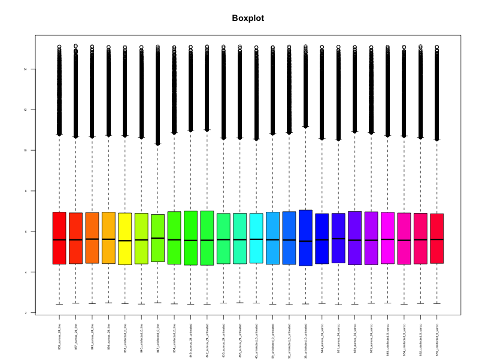
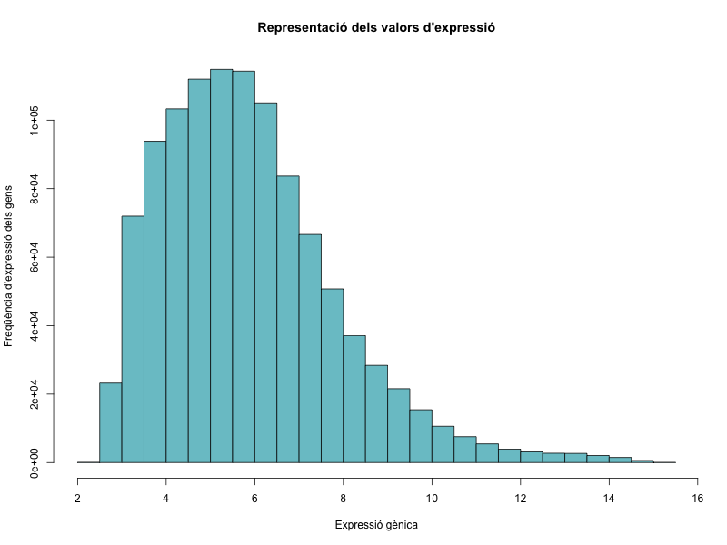
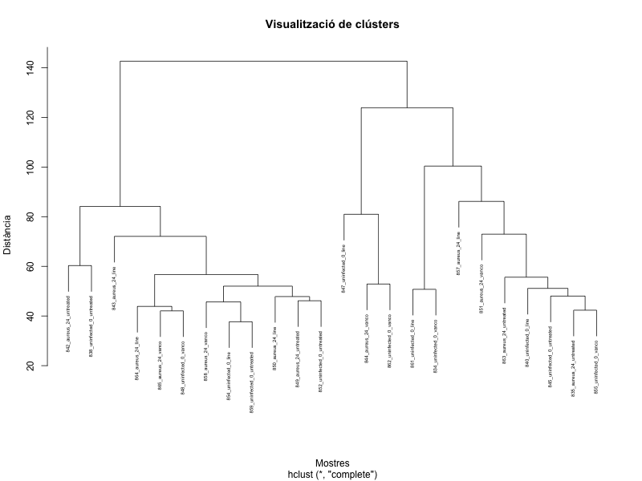
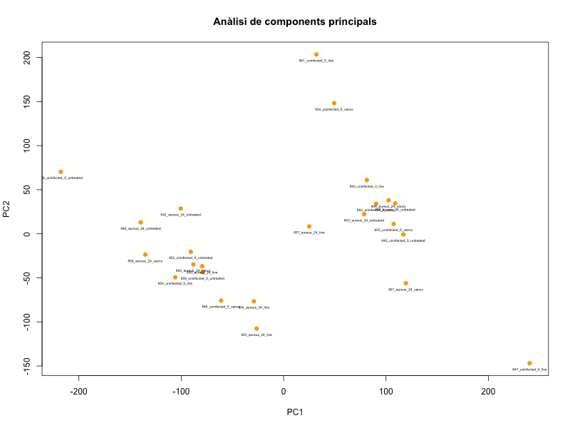
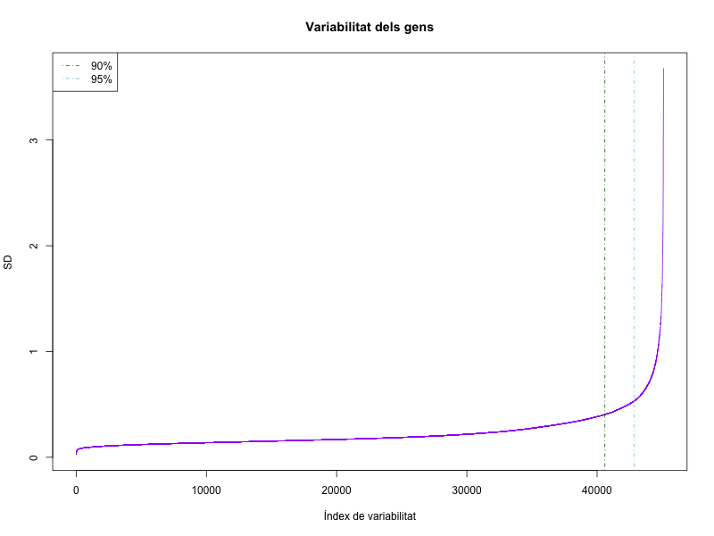
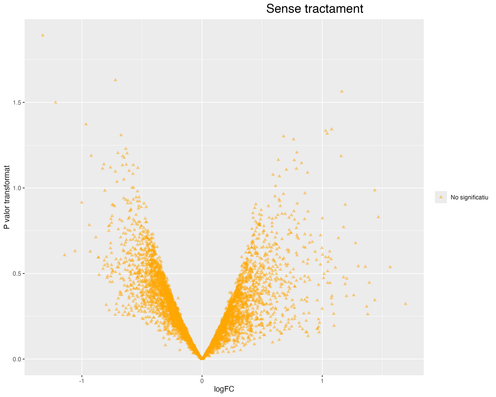
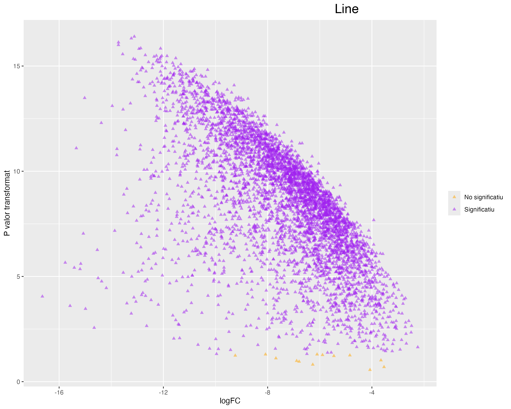
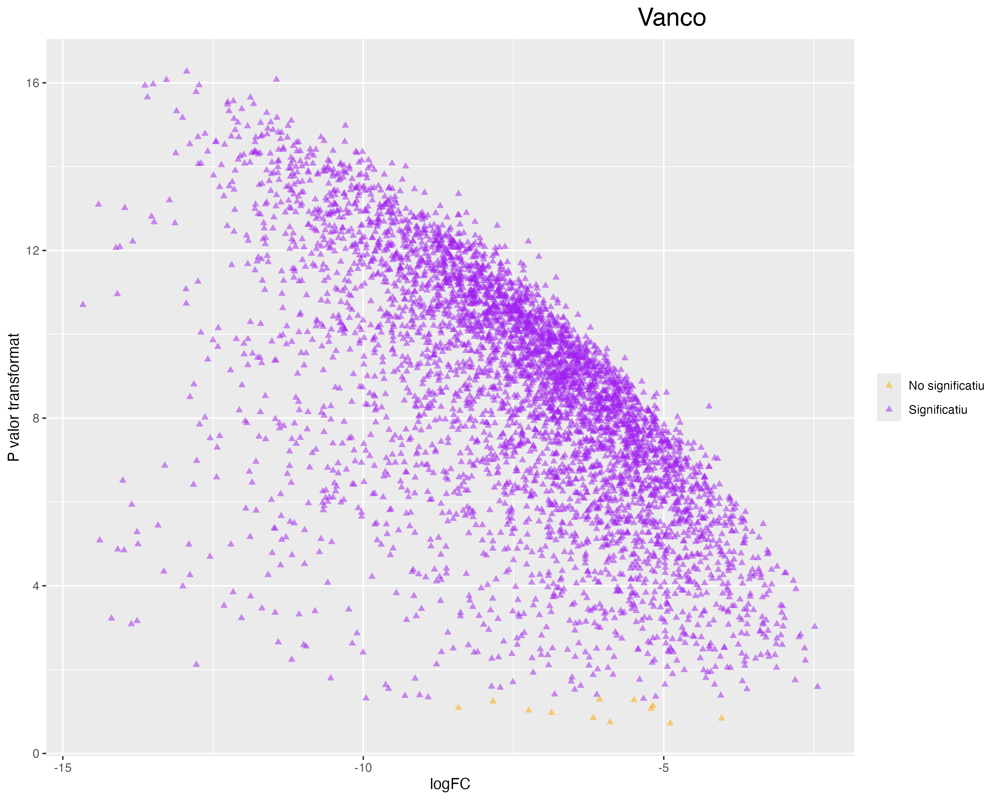
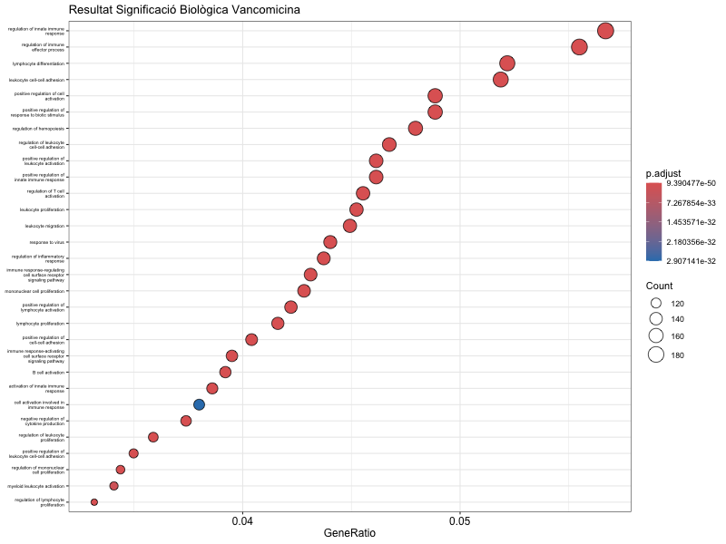

```{r, results='hide', message=FALSE, warning=FALSE, echo=FALSE}
getwd()
wd<-"/Users/annia/Library/CloudStorage/GoogleDrive-acniell@gmail.com/My Drive/UOC/TERCER QUADRIMESTRE/ANÀLISI DADES ÒMIQUES/PEC2"
dataDir <- file.path(wd, "dades")
resultsDir <- file.path(wd, "results")
```

# PEC 2

## TAULA DE CONTINGUTS

-   [INTRODUCCIÓ](#introducció)
-   [INFORME DE L'ANÀLISI](#informe_de_l_anàlisi)
-   [INTRODUCCIÓ I OBJECTIUS](#introducció_i_objectius)
-   [MÈTODES](#mètodes)
-   [RESULTATS](#resultats)
-   [DISCUSSIÓ](#discussió)
-   [REFERÈNCIES](#referències)
-   [APÈNDIX](#apèndix)
-   [PREPARACIÓ DE LES DADES](#preparació-de-les-dades)
    -   [TREBALLAR AMB GSE38531_SERIES_MATRIX.TXT](#treballar-amb-gse38531_series_matrix.txt)
    -   [DESCÀRREGA DELS FITXERS CEL A L'ENTORN LOCAL](#descàrrega-dels-fitxers-cel-a-l-entorn-local)
-   [ANÀLISI EXPLORATÒRIA I CONTROL DE QUALITAT](#anàlisi-exploratòria-i-control-de-qualitat)
    -   [DESCRIPCIÓ I DISTRIBUCIÓ DE LES DADES](#descripció-i-distribució-de-les-dades)
-   [FILTRATGE DE DADES](#filtratge_de_dades)
-   [MATRIUS DE DISSENY I CONTRASTS](#matrius_de_disseny_i_constrasts)
-   [ANOTACIÓ](#anotació)
-   [ANÀLISI DE SIGNIFICACIÓ BIOLÒGICA](#anàlisi_de_significació_biològica)

## INTRODUCCIÓ {#introducció}

Aquest és el document generat per la PEC2. Està vinculat al repositori de github <https://github.com/acniell/PEC2.git>. Es mostren tots els bloc de codi que s'han fet servir, tot i que no tots tindran sortida en el document. Els gràfics no són la generació directa dels chunks de codi per evitar sobrecarregar el document i la RAM, són imatges adjuntes de menor resolució i es troben a l'apartat d'apèndix. Per millorar la visualització en cas que es vulgui veure'ls amb més claredat, caldria correr el codi per a generar la imatge.

## INFORME DE L'ANÀLISI

### INTRODUCCIÓ I OBJECTIUS

Les bactèries multiresistents són un dels gran problemes del sistema sanitari, i que està en augment en l'actualitat, cosa que justifica la investigació pel desenvolupament d'antibiòtics per poder continuar tractant les infeccions. Una de les primeres bactèries que es van identificar va ser Staphylococcus aureus, un coc gram positiu, que amb el desenvolupament de les penicil·lines, ràpidament es va fer resistent a aquestes . El que presenten fenotip de resistència s'anomenen MRSA (methicillin resistant staphylococcus aureus) i es va aïllar el 1960 a nivell hospitalari. I tot i que no està present en totes les comunitats, cada vegada és més comú el MRSA comunitari (1980-1990 ja es detecta a Austràlia i EEUU). Per tant, s'han hagut d'anar desenvolupant antibiòtics per poder anar tractant les diferents bactèries multiresistents que van sorgint, i dos dels antibiòtics considerats fins ara de primera línia contra MRSA són el linezolid i la vancomicina (actualment també s'ha comercialitzat la ceftarolina que també és efectiva contra aquest i està disponible als hospitals ICS).

L'estudi original d'on hem extret les dades està disponible a <https://www.ncbi.nlm.nih.gov/geo/query/acc.cgi?acc=GSE38531>, i es van analitzar ratolins infectats i no infectats per MRSA (específicament MRSA USA-300), i no tracts i tractats (amb vanco o line). En aquests es va mirar la producció de toxines bacterianes i citocines, així com les diferències en l'expressió gènica dels diferents grups per intentar identificar quin antibiòtic és més efectiu en el tractament de la infecció per MRSA.

En el nostre cas, volem comparar l'efecte de no tractar vs tractar, i dins d'aquest segon grup el tractament amb line o vanco. L'efecte del tractament el mirarem segons l'expressió gènica que presenta cada grup i quines diferents vies implicades i hi ha, per així poder inferir si un dels dos antibiòtic és més efectiu que l'altre. Utilitzarem només 24 mostres de les recollides a l'estudi mencionat anteriorment i es crearan 3 comparacions:

-   Ratolins infectats vs. no infectats sense tractament.
-   Ratolins infectats vs. no infectats tractats amb linezolid.
-   Ratolins infectats vs. no infectats tractats amb vancomicina.

### MÈTODES {#mètodes}

Com s'ha mencionat anteriorment, les dades utilitzades són les pertanyents a l'estudi GSE38531 (<https://www.ncbi.nlm.nih.gov/geo/query/acc.cgi?acc=GSE38531>), de les quals s'ha aplicat un procés de selecció aleatòria per obtenir 24 mostres. L'anàlisi per tant s'ha aplicat a aquest subgrup de 24 mostres.

S'ha realitzat un procés d'anàlisi de qualitat, normalització i filtratge de les dades per poder realitzar les diferents comparacions entre grups. De les mostres, s'han seleccionat els gens amb més variabilitat (el 10% amb més variabilitat) que han estat un total de 4511. Per la comparació de grups, s'ha construit la matriu de disseny i així crear els grups de comparació mencionats anteriorment. Per a cada contrast s'han analitzat els gens diferencialment expressats i s'han seleccionat els que es consideren significatius amb els criteris de p valor ajustat\<0.05 i logFC\>1.

Per poder interpretar els resultats obtinguts, s'ha aplicat un procés d'anotació utilitzant Gene Ontology i associant els resultats especialment als identificadors d'ENTREZ i descriptors.

Finalment s'ha realitzar l'anàlisi de significació biològica per identificar les vies biològiques implicades en aquests gens diferencialment expressats i s'han comparat els resultats entre els diferents grups.

### RESULTATS {#resultats}

Després de l'anàlisi realitzat hem trobat que: amb el subgrup de mostres analitzades, no hi ha expressió diferencial de gens entre els grups de no infectat i infectat que **NO** han rebut tractament. **Sí** que hem trobat diferències en els grups que han estat tractats amb vancomicina i linezolid. D'aquests grups, el que crida més l'atenció és que d'aquests gens diferencialment expressats, tenen tendència a estar infra expressats i són molt similars les troballes entre la vancomicina i el linezolid (tot i que no idèntiques).

Això suggereix que l'efecte biològic d'aquests antibiòtics en els ratolins és similar, cosa que lògicament també és coherent ja que són dos fàrmacs efectius contra la infecció per MRSA.

Les vies que es veuen sobretot implicades són aquelles relacionades amb el sistema immunitari: regulació de la resposta innata, adhesió cel·lular, activació cel·lular i leucocitària, differenciació leucocitària... i són comunes tant a la vancomicina com el linezolid.

### DISCUSSIÓ {#discussió}

Amb els resultats obtinguts hi ha vàries coses que criden l'atenció:

-   En primer lloc, crida l'atenció que no hi hagi expressión diferencial de gens en ratolins infectats i no infectats. El sentit comú diu que davant una infecció hi ha d'haver certes vies de resposta immunitària destinades a defensar l'organisme que haurien d'estar molt més activades en els ratolins infectats, ja que és el nostre sistema de defensa. Per tant, no trobar diferències en aquest grup de comparació és motl estrany. Podria ser que hi hagués un error ens càlculs realitzats o bé que el resultat trobat no sigui extrapolable perquè hem realitzat l'anàlisi amb un subgrup de mostres i no el dataset sencer.

-   En segon lloc s'ha evidenciat que el fet de rebre tractament antibiòtic modula de forma clara la resposta immunitària a l'hoste. Tot i així, destaca però la GRAN similitud dels resultats obtinguts amb linezolid i vancomicina. \
    El linezolid és una oxazolidinona i la vancomicina és un glucopèptid, dues famílies diferents d'antibiòtics i que són efectives contra la infecció per MRSA però per vies diferents. Per tant, també sorprèn molt que presentant mecanismes d'acció diferents tinguin un resultat tan similar. El resultat final però d'aquestes vies està clar i és a disminuir la càrrega bacteriana a l'hoste.

-   Per últim, destacar que el que veiem és una diminució en l'activació d'aquestes vies, no una sobreactivació. Tot i que el primer que es pot reflexionar és que hauria de ser a l'inversa, ja que l'organisme ha de lluitar contra la infecció, en la sèpsia està descrit que la resposta immune pot ser excessiva, passant a ser perjudicial. Podria ser que precisament l'administració d'antibiòtic equilibrés les respostes immunes, evitant una sobreinflamació en l'hoste, i per tant traduint-se a infraexpressió gènica.

### REFERÈNCIES {#referències}

-   Guies mèdiques de Surviving sepsis campaign. Maneig òptim del codi sèptic en els humans: <https://www.sccm.org/clinical-resources/guidelines/guidelines/surviving-sepsis-guidelines-2021>

-   Història de MRSA: <https://www.health.state.mn.us/diseases/staph/mrsa/basics.html>

-   III update d'infeccions multiresistents (MRSA) organitzat per SOCMIC el 11 de desmebre del 2014 a l'Hospital Dr. Josep Trueta de Girona: presentació power point de la sessió cedida per Dra. Lopez de Arbina.

-   Documentació de l'assignatura anàlisi de dades òmiques UOC. Semestre hivern 2024-2025.

# APÈNDIX {#apèndix}

## PREPARACIÓ DE LES DADES {#preparació-de-les-dades}

Carreguem l'arxiu de allTargets per fer la selecció.

```{r alltargets}
allTargets <- read.table("allTargets.txt", header = TRUE, sep = " ", stringsAsFactors = FALSE)
```

Apliquem el codi cedit:

```{r codi_PEC2}
filter_microarray <- function(allTargets, seed =123) {
  set.seed(seed)
  filtered <- subset(allTargets, time != "hour 2")
  
  # Dividir el dataset por grupos únicos de 'infection' + 'agent'
  filtered$group <- interaction(filtered$infection, filtered$agent)
  
  # Seleccionar 4 muestras al azar de cada grupo
  selected <- do.call(rbind, lapply(split(filtered, filtered$group), function(group_data) {
    if (nrow(group_data) > 4) {
      group_data[sample(1:nrow(group_data), 4), ]
    } else {
      group_data
    }
  }))
  
  # Obtener los índices originales como nombres de las filas seleccionadas
  original_indices <- match(selected$sample, allTargets$sample)
  
  # Modificar los rownames usando 'sample' y los índices originales
  rownames(selected) <- paste0(selected$sample, ".", original_indices)
  
  # Eliminar la columna 'group' y devolver el resultado
  selected$group <- NULL
  return(selected)
}
```

Fem la selecció aleatòria i la guardem en un nou fitxer per si el necessitem a posteriori. En aquest cas farem servir el número de DNI per l'aleatorització.

```{r random_DNI, results='hide'}
# Aplicar la función (cambiar 123 por vuestro ID de la UOC u otro número que podáis escribir en el documento)
resultat_mostra <- filter_microarray(allTargets, seed=41577436)
print(resultat_mostra)

### Aprofitarem i ajustarem ara els noms, perquè no s'havia fet prèviament i ha generat problemes amb limma.

resultat_mostra$infection <- gsub("S\\. aureus USA300", "aureus", resultat_mostra$infection) 
resultat_mostra$time <- gsub("hour ", "", resultat_mostra$time)
resultat_mostra$agent <- gsub("linezolid", "line", gsub("vancomycin", "vanco", resultat_mostra$agent))  
resultat_mostra$nom <- paste0(
  sub("GSM944", "", resultat_mostra$sample), "_", 
  resultat_mostra$infection, "_", 
  resultat_mostra$time, "_", 
  resultat_mostra$agent
)

write.table(resultat_mostra, file = file.path(dataDir, "mostra_seleccionada_41577436.txt"), 
            sep = "\t", row.names = FALSE)
```

Ja tenim una selecció de 24 mostres aleatòries del dataset amb les que treballar.

Ara tenim dues opcions: o descarreguem de la pàgina de GEO el supplementary File amb els arxius CEL a dins i seleccionem els que havien sortit amb la selecció aleatòria o bé treballem amb el fitxer "series matrix" disponible a la pàgina de GEO. Mostrem primer com es faria amb la segona opció, però treballarem amb la primera (descàrrega a l'entorn local del fitxers CEL).

### TREBALLAR AMB GSE38531_SERIES_MATRIX.TXT {#treballar-amb-GSE38531_SERIES_MATRIX.TXT}

```{r carreguem_matriu, eval=FALSE, echo=TRUE, results='hide', message=FALSE, warning=FALSE}
BiocManager::install("GEOquery")
library(GEOquery)
GSE38531<-getGEO("GSE38531", GSEMatrix = TRUE, parseCharacteristics = FALSE) #descarreguem la matriu
```

Ara accedirem als diferents blocs d'informació per veure que estigui tot correcte a primera vista:

```{r expressionSet, eval=FALSE, echo=TRUE, results='hide', message=FALSE, warning=FALSE}
ES<- GSE38531[[1]] 
matriu_expressio<-exprs(ES)
head(matriu_expressio)
fenodata<-pData(ES)
head(fenodata)
```

Ara volem agafar només la informació les mostres que hem seleccionat amb l'aleatorització.

```{r shrink_matrix}
mostres <- read.table(file.path(dataDir, "mostra_seleccionada_41577436.txt"), 
                      header = TRUE, sep = "\t", stringsAsFactors = FALSE)
noms_mostra<-mostres$nom #llista dels que volem. 
```

```{r filtrar, eval=FALSE, echo=TRUE, results='hide', message=FALSE, warning=FALSE}
sampleNames(ES)->noms_ES
coincidencies<-intersect(noms_mostra, noms_ES)
coincidencies #veiem que efectivament hi ha 24 elements a la llista. 
ES2<-ES[,coincidencies]
ES2
```

Ja tenim creat el nostre expressionSet amb la mostra que hem seleccionat aleatòriament.

```{r expression_Set, eval=FALSE, echo=TRUE, results='hide', message=FALSE, warning=FALSE}
#ens el guardem per si el necessitem més tard naive
write.csv(exprs(ES2), file = file.path(dataDir, "ES2.csv"))
```

### DESCÀRREGA DELS FITXERS CEL A L'ENTORN LOCAL {#descàrrega-dels-fitxers-cel-a-l-entorn-local}

A la pàgina web de GEO (<https://www.ncbi.nlm.nih.gov/geo/query/acc.cgi?acc=GSE38531>) veiem que hi ha un arxiu anomenat Supplementary File on tenim tots els arxius CEL. Una vegada descarregats, eliminem els que no ens interessen després de fer la selecció aleatòria, ens quedem els que sí, i els hi ajustem el nom:

{width="93"}

En aquest cas farem servir la llibreria oligo (els passos estan basats en el document cedit per la UOC "Statistical Analysis of Microarray data" <https://aspteaching.github.io/Omics_Data_Analysis-Case_Study_1-Microarrays/Case_Study_1-Microarrays_Analysis.html> ).

```{r rawData, message=FALSE, warning=FALSE, results='hide'}
library(oligo) #pels elements CEL
library(Biobase) 
arxius_CEL <- list.celfiles("/Users/annia/Library/CloudStorage/GoogleDrive-acniell@gmail.com/My Drive/UOC/TERCER QUADRIMESTRE/ANÀLISI DADES ÒMIQUES/PEC2/PEC2/ARXIUS CEL", full.names = TRUE) #carreguem els documents CEL. 
phenoData<-AnnotatedDataFrame(data = mostres)
rawData<-read.celfiles(arxius_CEL, phenoData=phenoData) #creem l'arxiu rawData
```

Ja hem llegit els arxius CEL i hem associat la informació de l'element mostres, que té la selecció aleatòria que hem fet anteriorment.

## ANÀLISI EXPLORATÒRIA I CONTROL DE QUALITAT {#anàlisi-exploratòria-i-control-de-qualitat}

Prèviament a la normalització, anem a veure la qualitat de les nostres dades i que no hi hagi cap outlier que hàgim de gestionar. Això ho fem amb el paquet arrayQualityMetrics. Els documents generats amb aquesta funció, es poden trobar al repositori github.

```{r qualitat, eval=FALSE, echo=TRUE, results='hide', message=FALSE, warning=FALSE}
BiocManager::install("arrayQualityMetrics")
library(arrayQualityMetrics)
arrayQualityMetrics(rawData, force=FALSE)
```

El document generat ens aporta un informe on podem identificar a través de boxplot i PCA si tenim outliers. En el document mencionat anteriorment de la UOC recomanen revisar els outliers que s'identifiquin com a tal en \> o = 3 proves diferents dins la realització d'un estudi de qualitat de les dades. En el nostre cas veiem que es detecta un outlier en dues proves, pel que de moment el mantindrem dins del nostre dataset.

Seguirem per normalitzar les dades que hem generat anteriorment amb RMA tal com es proposa:

```{r normalitza_rma, message=FALSE, warning=FALSE, results='hide'}
ESet <- rma(rawData)
rawData
```

Una vegada creat el nostre expressionSet, assegurarem que el nom de les mostres sigui el de la columna sample del fitxer mostres i farem una consulta ràpida dels elements per veure que estiguin bé:

```{r expressionSet_CEL, message=FALSE, warning=FALSE, results='hide'}
mostres$nom
sampleNames(ESet)<-mostres$nom
sampleNames(ESet)
pData(ESet)
head(ESet)
```

### DESCRIPCIÓ I DISTRIBUCIÓ DE LES DADES {#descripció_i_distribució_de_les_dades}

Una vegada realitzada la normalització, i ens hem assegurat que les dades estan correctament creades, anem a fer una exploració bàsica de les dades que tenim:

```{r exploració, message=FALSE, warning=FALSE}
matriu2<-exprs(ESet)
dim(matriu2)
str(matriu2)
head(matriu2)
summary(matriu2)
sum(is.na(matriu2))
```

Tot seguit farem una representació gràfica per veure com es distribueixen de forma visual:

```{r boxplot, message=FALSE, warning=FALSE, results='hide'}
output_file <- file.path(resultsDir, "boxplot.png")
png(file = output_file, width = 1000, height = 800)
boxplot(matriu2, main="Boxplot", col = rainbow(ncol(matriu2)), cex.axis=0.4, las=2)
dev.off()
```



Veiem que globalment les medianes estan alineades i les distribucions són similars. No s'observa cap mostra que sobresurti més que la resta.

```{r histograma, message=FALSE, warning=FALSE, results='hide'}
output_file <- file.path(resultsDir, "histograma_expressio.png")
png(file = output_file, width = 800, height = 600)
hist(as.numeric(as.matrix(matriu2)), 
     main="Representació dels valors d'expressió",
     xlab="Expressió gènica", 
     ylab="Freqüència d'expressió dels gens",
     col="cadetblue3", breaks=35)
dev.off()
```



Amb aquest histograma veiem clarament una cua a la dreta, cosa que pot suggerir que les dades hagin passat per una transformació tipus logarítmica.

Continuem amb un dendograma per veure com s'agrupen les mostres.

```{r dendograma, message=FALSE, warning=FALSE, results='hide'}
output_file <- file.path(resultsDir, "dendograma.png")
png(file = output_file, width = 800, height = 600)
distancia <- dist(t(matriu2)) 
clustering <- hclust(distancia)
plot(clustering, 
     main="Visualització de clústers",
     xlab="Mostres", ylab="Distància", 
     cex=0.5) 
dev.off()
```



No veiem que hi hagi una diferenciació clara entre tractament rebut (res, linezolid o vancomicina) però a simple vista podria ser que hi hagia més mostres de les 24 a l'esquerra i de 0h a la dreta. Tot i així, no m'impressiona que hi hagi un efecte batch que no hàgim detectat.

Procedim a fer una anàlisi de components principals:

```{r PCA, message=FALSE, warning=FALSE}
pca <- prcomp(t(matriu2), scale.=TRUE) 
summary(pca)
```

Amb aquests resultats inicials veiem que la primera component ens explica el 27,47% i la segona 18,25%.

```{r plot_PCA, message=FALSE, warning=FALSE, results='hide'}
output_file <- file.path(resultsDir, "plotPCA.png")
png(file = output_file, width = 800, height = 600)
plot(pca$x[,1], pca$x[,2], 
     xlab="PC1", 
     ylab="PC2",
     main="Anàlisi de components principals",
     pch=19, col="orange")
     
text(pca$x[,1], pca$x[,2], labels=colnames(matriu2), pos=1, cex=0.4)
dev.off()
```



Veiem que algunes mostres sí que es veuen aïllades de la resta pel que hi pot haver diferències en l'expresisó gènica.

## FILTRATGE DE DADES {#filtratge_de_dades}

Per veure primer quins sóns els gens amb més variabilitat, mirarem les seves distribucions i les representarem per visualitzar-ho millor.

```{r llista_SD, message=FALSE, warning=FALSE}
desv_std<-apply(matriu2, 1, sd)
sorted_desv_std<-sort(desv_std)
head(sorted_desv_std)
```

```{r visualització_SD, message=FALSE, warning=FALSE, results='hide'}
output_file <- file.path(resultsDir, "plotSD.png")
png(file = output_file, width = 800, height = 600)
plot(1:length(sorted_desv_std), sorted_desv_std, 
     main="Variabilitat dels gens",
     xlab="Índex de variabilitat", 
     ylab="SD",
     type="l", col="purple", lwd=1)

# Afegir línies verticals als percentils 90% i 95%
abline(v=length(sorted_desv_std)*c(0.9, 0.95), col=c("darkgreen", "cadetblue3"), lwd=1, lty=4)

# Llegenda
legend("topleft", legend=c("90%", "95%"), 
       col=c("darkgreen", "cadetblue3"), lwd=1, lty=4)
dev.off()
```



Una vegada hem vist això anirem a buscar, tal com se suggereix, el 10% més variable.

```{r pool_filtrat, message=FALSE, warning=FALSE}
limit90<- quantile(desv_std, 0.9)
pool10 <- matriu2[desv_std >= limit90, ]
dim(pool10)  
```

Finalment, ens quedem doncs com a mostra amb 4511 gens de 24 mostres.

## MATRIUS DE DISSENY I CONTRASTS {#matrius_de_disseny_i_contrasts}

Ja tenim anteiorment generada una taula amb la fenodata que necessitem, anem a refrescar-la:

```{r mostres_fenodata, message=FALSE, warning=FALSE}
str(mostres)
mostres$infection <- factor(mostres$infection, levels=c("uninfected", "aureus"))
mostres$agent <- factor(mostres$agent, levels=c("untreated", "line", "vanco"))
#trec les variable sque no necessitaré per les comparacions.
mostres <- mostres[, !(colnames(mostres) %in% c("time", "nom"))]
#str(mostres)
```

En les comparacions que ens demanen, en cap moment es parla de línia temporal, pel que de moment, agafarem les mostres que tenim, però obviarem la línia temporal (és a dir les hores). Agruparem les mostres independentment de si és 0h o 24h; així aconseguirem dos grans grups: infectats i no infectats. I tot seguit els tres subgrups de tractament: n**o tractament, vancomicina o linezolid**.

```{r disseny, message=FALSE, warning=FALSE}
disseny <- model.matrix(~ 0 + infection * agent, data = mostres)
colnames(disseny) <- gsub(":", "_", colnames(disseny))
disseny
colnames(disseny)
```

I tal com ens han proposat, dissenyarem els tres contrastos:

\- Infectats vs no infectats, en el grup *sense tractament* (seria grup base).

\- Infectats vs no infectats, en el grup de tractament amb *linezolid.*

\- Infectats vs no infectats, en el grup de tractament amb *vancomcina.*

Això ho farem amb el paquet limma.

```{r constrasts, message=FALSE, warning=FALSE}
library(limma)
contrasts <- makeContrasts(
  Infectats_vs_Noinfectats_Untreated = infectionaureus - infectionuninfected,
  Infectats_vs_Noinfectats_Linezolid = infectionaureus_agentline - (infectionuninfected + agentline),
  Infectats_vs_Noinfectats_Vancomycin = infectionaureus_agentvanco - (infectionuninfected + agentvanco),
  levels = disseny
)

print(contrasts)
```

Finalment queda fer l'estimació del model, ja que volem detectar quins gens tenen expressió diferencial a través de la comparació de cada gen en les dues situacions experimentals (infectat vs no infectat amb un mateix tractament en comú (no tractament, line o vanco).

Els resultats generats els guardarem per si ens fessin falta més endavant.

```{r model, message=FALSE, warning=FALSE}
fit <- lmFit(pool10, design = disseny)
fit2 <- contrasts.fit(fit, contrasts)
fit2 <- eBayes(fit2)

# Obtenir els resultats per a cada comparació
resultats_untreated <- topTable(fit2, coef="Infectats_vs_Noinfectats_Untreated", n=Inf)
head(resultats_untreated)
resultats_line<- topTable(fit2, coef="Infectats_vs_Noinfectats_Linezolid", n=Inf)
head(resultats_line)
resultats_vanco<- topTable(fit2, coef="Infectats_vs_Noinfectats_Vancomycin", n=Inf)
head(resultats_vanco)


write.csv(resultats_untreated, file.path(resultsDir, "resultats_infectats_vs_noinfectats_untreated.csv"), row.names=TRUE)
write.csv(resultats_line, file.path(resultsDir, "resultats_infectats_vs_noinfectats_linezolid.csv"), row.names=TRUE)
write.csv(resultats_vanco, file.path(resultsDir, "resultats_infectats_vs_noinfectats_vancomicina.csv"), row.names=TRUE)
```

A les taules resultants, sobretot ens interessa fixar-nos en:

-   La columa de logFC, on veurem l'efecte dels gens. Quan és negatiu podem interpretar que està infra expressat, i el contrari quan és positiu.

-   La columna de p valor i p valor ajustat que ens ajudaran a veure quin gens tenen canvis significatius.

## ANOTACIÓ {#anotació}

A les taules generades, veiem que la primera columna és le gen però si no sabem res més, ens aporta poca informació realment ja que no en podem interpretar res amb aquell nom. Per tant, ara procedirem a fer el pas que s'anomena anotació. Ho farem en base a l'exemple de <https://aspteaching.github.io/Omics_Data_Analysis-Case_Study_1-Microarrays/Case_Study_1-Microarrays_Analysis.html#environment-preparation>, tal i com hem anat mencionant.

Haurem de mirar a la pàgina de GEO la plataforma utilitzada per així saber quin array s'ha utilitzat i saber quina base de dades hem de fer servir pel procés d'anotació (això també es podria fer a través de R, si li demanem que ens retori l'objecte rawData veiem a ens diu en un dels apartats que Annotation: pd.mouse430.2). En aquest cas és [Mouse430_2] Affymetrix Mouse Genome 430 2.0 Array.

```{r anotació, message=FALSE, warning=FALSE, results='hide'}
library(annotate)
library(mouse4302.db)

annotatedTopTable <- function(topTab, anotPackage) {
  topTab <- cbind(PROBEID=rownames(topTab), topTab) #les etiquetes/identificadors de les sondes. Afegim la columna PROBEID.
  myProbes <- rownames(topTab)
  thePackage <- eval(parse(text = anotPackage))
  geneAnots <- select(thePackage, myProbes, c("SYMBOL", "ENTREZID", "GENENAME"))
  annotatedTopTab <- merge(x=geneAnots, y=topTab, by.x="PROBEID", by.y="PROBEID")
  return(annotatedTopTab)
}
```

```{r anotacio2, message=FALSE, warning=FALSE}
annotated_untreated <- annotatedTopTable(resultats_untreated, 
                                         anotPackage="mouse4302.db")
head(annotated_untreated)
annotated_line <- annotatedTopTable(resultats_line, 
                                    anotPackage="mouse4302.db")
head(annotated_line)
annotated_vanco <- annotatedTopTable(resultats_vanco, 
                                     anotPackage="mouse4302.db")
head(annotated_vanco)
```

A continuació farem una representació gràfica dels nostres resultats. En aquest cas farem servir com a límits un p valor \<0.05 i logFC\>1. Com bé es menciona en l'assignatura, no existeix un límit establert per fer aquest punt de tall, sinó que es basa en sentit comú i plausibilitat biològica. És per aquest motiu que farem servir aquest valor i logFC.

```{r volcano, message=FALSE, warning=FALSE, results='hide'}
library(ggplot2)
#per crear el gràfic, com que ho haurem de fer 3 vegades, ho farem a través d'una funció. 

create_volcano <- function(resultats, titol) {
  resultats$Significant <- with(resultats, 
    ifelse(adj.P.Val < 0.05 & abs(logFC) > 1, "Significatiu", "No significatiu")
  ) #amb això analitzem cada element i determinem si és o no significatiu segons si p<0.05 i logFC>1
  
  ggplot(resultats, aes(x = logFC, y = -log10(P.Value), color = Significant)) +
    geom_point(alpha = 0.5, size = 1.5, shape=17) +
    scale_color_manual(values = c("orange", "purple")) +
    labs(
      title = titol,
      x = "logFC",
      y = "P valor transformat"
    ) +
    theme(
      plot.title = element_text(hjust = 0.8, size = 18),
      legend.title = element_blank()
    )
}

save_volcano <- function(plot, filename) {
  ggsave(
    filename = file.path(resultsDir, filename),
    plot = plot,
    width = 10, height = 8, dpi = 300
  )
}

# Crear Volcano Plots per a cada comparació
volcano_untreated <- create_volcano(resultats_untreated, "Sense tractament")
volcano_line <- create_volcano(resultats_line, "Line")
volcano_vanco <- create_volcano(resultats_vanco, "Vanco")

save_volcano(volcano_untreated, "volcano_untreated.png")
save_volcano(volcano_line, "volcano_line.png")
save_volcano(volcano_vanco, "volcano_vanco.png")

```



Al primer gràfic veiem que tots els punts són NO SIGNIFICATIUS. Per tant no hi ha hagut diferències singifcatives en l'expressió gènica entre els infectats i no infectats que no han rebut tractament.



En segon lloc tenim el gràfic del tractament amb linezolid: veiem a l'eix que les X que la gran majoria dels punts estan a per sota el 0 (són valors negatius). Com dèiem abans, això es tradueix amb gens que estan infra expressats en aquest cas. A l'eix Y veiem el p valor transformat. Tot i que hi ha una cua de valors que queda per sota el valor 5, la gran majoria queda per sobre, i es considerarien estadísticament significatius.



Per últim, la situació de la vancomicina és similar a la del linezolid, tot i que té un volum una mica més elevat de punts que no serien significatius.

A continuació compararem els gens diferencialment expressats entre les diferents situacions clíniques: els no tractat, i el que sí, amb linezolid i vancomicina respectivament. En aquest cas, agafem els gens que tinguin un p-valor associat \<0.05. Crearem 3 objectes per emmagatzemar el llistat de gens que compleixin el criteri.

```{r comparacio_multiple, message=FALSE, warning=FALSE}
seleccio <- decideTests(
  fit2, 
  method = "separate",        
  adjust.method = "fdr",      
  p.value = 0.05,       
  lfc = 1                     
)

print(summary(seleccio))

# Filtrar només els gens diferencialment expressats
sum.seleccio.rows <- apply(abs(seleccio), 1, sum)
seleccio.selected <- seleccio[sum.seleccio.rows != 0, ]
```

Ja tenim la taula resum comparant-nos els dos estats (infectat vs no infectat) de cada grup i com es comporten els gens implicats. Agafem per exemple el primer grup Infectats_vs_Noinfectats_Untreated: com veiem, igual que al gràfic anterior, no tenim cap gen que s'expressi de forma diferencial (tots són no signifcatius). En canvi en els grups d'antibiòtic, sorprenentment veiem que hi ha el mateix nombre de gens que estan diferencialment expressats (negativament en aquest cas), i és més, dels gens que hem seleccionat en tot el procés analític, únicament 13 (12 en el cas de la vancomicina) no són significatius.

## ANÀLISI DE SIGNIFICACIÓ BIOLÒGICA {#anàlisi_de_significació_biològica}

A continuació fem l'anàlisi de significació biològica i ho farem a través de GO Gene Ontology. Primer agafarem els identificadors dels gens significatius, en aquest cas els ENTREZID.

```{r entrez, message=FALSE, warning=FALSE}
# Selecionem els ENTREZ ID 
ID_untreated <- annotated_untreated$ENTREZID[annotated_untreated$adj.P.Val < 0.05]
ID_line <- annotated_line$ENTREZID[annotated_line$adj.P.Val < 0.05]
head(ID_line)
ID_vanco <- annotated_vanco$ENTREZID[annotated_vanco$adj.P.Val < 0.05]
head(ID_vanco)
```

No fem l'anàlisi del grup sense tractament perquè ja hem vist que no té gens significatius.

```{r enrichGO, message=FALSE, warning=FALSE, results='hide'}
library(clusterProfiler)
library(org.Mm.eg.db)

go_enrich_line <- enrichGO(
  gene = ID_line, #els gens significatius dels que han rebut el tractament amb line
  OrgDb = org.Mm.eg.db,
  ont = "BP", #a triar entre BP, MF, CC.
  pAdjustMethod = "BH",
  pvalueCutoff = 0.05,
  readable = TRUE
)

go_enrich_vanco <- enrichGO(
  gene = ID_vanco, #els gens significatius dels que han rebut el tractament amb vanco
  OrgDb = org.Mm.eg.db,
  ont = "BP",
  pAdjustMethod = "BH",
  pvalueCutoff = 0.05,
  readable = TRUE
)
```

Fet l'anàlisi, en fem la representació gràfica amb un dotplot per visualitzar-ho. Crida MOLT l'atenció, que si més no els primers gens diferencialment expressats, són pràcticament idèntics en ambdós grups.

Alguna diferència hi ha (es comprova en el següent bloc de codi) entre els dos resultats, però sobretot el que veiem és que les vies que s'activen són les de resposta immune. Això és molt coherent ja que estem treballant amb una infecció per MRSA i els seus tractaments de primera línia (vancomicina i linezolid).

Són dos antibiòtics molt diferents, és a dir, no pertanyen a la mateixa família d'antibiòtics; la vancomicina és un glicopèptid i el linezolid una oxazolidinona. Tot i així, la resposta que generen a l'hoste és similar: actiavació de les vies immunes i de la proliferació cel·lular. En resum, tot encarat en lluitar contra una infecció.

```{r dotplot, message=FALSE, warning=FALSE, results='hide'}
output_file <- file.path(resultsDir, "dotplot_line.png")
png(file = output_file, width = 800, height = 600)
library(ggplot2)
dotplot(go_enrich_line, showCategory = 30, title = "Resultat Significació Biològica Linezolid")+theme(axis.text.y = element_text(size = 5))

output_file <- file.path(resultsDir, "dotplot_vanco.png")
png(file = output_file, width = 800, height = 600)
dotplot(go_enrich_vanco, showCategory = 30, title = "Resultat Significació Biològica Vancomicina")+theme(axis.text.y = element_text(size = 5))
dev.off()
```

](images/dotplot_line.png)

```{r, message=FALSE, warning=FALSE, results='hide'}
llista_vanco<- as.data.frame(go_enrich_vanco)
llista_line<- as.data.frame(go_enrich_line)
```

El bloc de codi anterior, es permet veure en una llista les diferents vies identificades en el procés d'anàlisi biològica. Majoritàriament són vies relacionades amb el sistema immunològic.

```{r}
if (identical(llista_vanco, llista_line)) {
  print("Les dues llistes són idèntiques.")
} else {
  print("Les dues llistes NO són idèntiques.")
}
```
