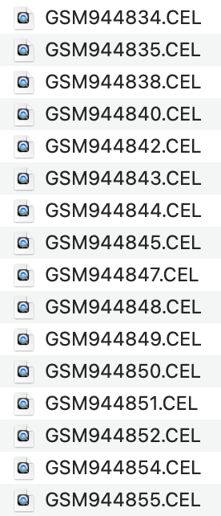

```{r setup, include=FALSE}
knitr::opts_chunk$set(echo = TRUE)
```

```{r eines, results='hide', message=FALSE}
install.packages("BiocManager")
BiocManager::install("oligo")
BiocManager::install("pd.mogene.2.1.st")
BiocManager::install("arrayQualityMetrics")
BiocManager::install("pvca")
BiocManager::install("limma")
BiocManager::install("genefilter")
BiocManager::install("mogene21sttranscriptcluster.db")
BiocManager::install("annotate")
BiocManager::install(c("affy", "Biobase"))
BiocManager::install("GEOquery")
library(GEOquery)
library(oligo)
library(affy)
library(Biobase)
install.packages("gplots")
install.packages("ggplot2")
install.packages("prettydoc")
install.packages("devtools")

```

```{r, results='hide', message=FALSE}
getwd()
wd<-"/Users/annia/Library/CloudStorage/GoogleDrive-acniell@gmail.com/My Drive/UOC/TERCER QUADRIMESTRE/ANÀLISI DADES ÒMIQUES/PEC2/PEC2"
dataDir <- file.path(wd, "dades")
resultsDir <- file.path(wd, "results")
```

# PEC 2

## TAULA DE CONTINGUTS

-   [INTRODUCCIÓ](#introducció)

-   [PREPARACIÓ DE LES DADES](#preparació-de-les-dades)

-   [TREBALLAR AMB GSE38531_SERIES_MATRIX.TXT](#treballar-amb-GSE38531_SERIES_MATRIX.TXT)

-   [DESCÀRREGA DELS FITXERS CEL A L'ENTORN LOCAL](#descàrrega-dels-fitxers-cel-a-l-entorn-local)

-   [ANÀLISI EXPLORATÒRIA I CONTROL DE QUALITAT](#anàlisi-exploratòria-i-control-de-qualitat)

    -   [DESCRIPCIÓ I DISTRIBUCIÓ DE LES DADES](#descripció_i_distribució_de_les_dades)
    
-   [FILTRATGE DE DADES](#filtratge_de_dades)
    
-   [DISCUSSIÓ I LIMITACIONS I CONCLUSIONS DE L'ESTUDI](#discussio-i-limitacions-i-conclusions-de-lestudi)

-   [ANNEX: CODI DE R I GRÀFICS](#annex-codi-de-r-i-gràfics)

-   [1. IMPORTAR I CARREGAR LES DADES](#importar-i-carregar-les-dades)

-   [2. EXPLORACIÓ MÍNIMA ORIENTATIVA](#exploració-mínima-orientativa)

-   [3. CREACIÓ DEL SUMMARIZED EXPERIMENT](#creació-del-summarized-experiment)

-   [4. EXPLORACIÓ DEL SUMMARIZED EXPERIMENT (SE)](#exploració-del-summarized-experiment-se)

-   [5. ANÀLISI DE PCA](#anàlisi-de-pca)

    -   [5.1 CÀRREGUES DELS METABOLITS A PC1 I PC2](#càrregues-dels-metabòlits-a-pc1-i-pc2)

## 1. INTRODUCCIÓ {#introducció}

### 2. PREPARACIÓ DE LES DADES {#preparació-de-les-dades}

Carreguem l'arxiu de allTargets per fer la selecció.

```{r}
allTargets <- read.table("allTargets.txt", header = TRUE, sep = " ", stringsAsFactors = FALSE)
```

Apliquem el codi cedit:

```{r}
filter_microarray <- function(allTargets, seed =123) {
  set.seed(seed)
  filtered <- subset(allTargets, time != "hour 2")
  
  # Dividir el dataset por grupos únicos de 'infection' + 'agent'
  filtered$group <- interaction(filtered$infection, filtered$agent)
  
  # Seleccionar 4 muestras al azar de cada grupo
  selected <- do.call(rbind, lapply(split(filtered, filtered$group), function(group_data) {
    if (nrow(group_data) > 4) {
      group_data[sample(1:nrow(group_data), 4), ]
    } else {
      group_data
    }
  }))
  
  # Obtener los índices originales como nombres de las filas seleccionadas
  original_indices <- match(selected$sample, allTargets$sample)
  
  # Modificar los rownames usando 'sample' y los índices originales
  rownames(selected) <- paste0(selected$sample, ".", original_indices)
  
  # Eliminar la columna 'group' y devolver el resultado
  selected$group <- NULL
  return(selected)
}

```

Fem la selecció aleatòria i la guardem en un nou fitxer per si de cas.

```{r}
# Aplicar la función (cambiar 123 por vuestro ID de la UOC u otro número que podáis escribir en el documento)
resultat_mostra <- filter_microarray(allTargets, seed=41577436)
print(resultat_mostra)

### Aprofitarem i ajustarem ara els noms, perquè no s'havia fet prèviament i ha generat problemes amb limma.

resultat_mostra$infection <- gsub("S\\. aureus USA300", "aureus", resultat_mostra$infection) 
resultat_mostra$time <- gsub("hour ", "", resultat_mostra$time)
resultat_mostra$agent <- gsub("linezolid", "line", gsub("vancomycin", "vanco", resultat_mostra$agent))  
resultat_mostra$nom <- paste0(
  sub("GSM944", "", resultat_mostra$sample), "_", 
  resultat_mostra$infection, "_", 
  resultat_mostra$time, "_", 
  resultat_mostra$agent
)

print(head(resultat_mostra))
write.table(resultat_mostra, file = file.path(dataDir, "mostra_seleccionada_41577436.txt"), 
            sep = "\t", row.names = FALSE)
```

Ja tenim una selecció de 24 mostres aleatòries del dataset amb les que treballar.

Ara tenim dues opcions: o descarreguem de la pàgina de GEO el supplementary File amb els arxius CEL a dins i seleccionem els que havien sortit amb la selecció aleatòria o bé treballem amb el fitxer "series matrix" disponible a la pàgina de GEO. Comencem primer amb la segona opció:

#### 2.1 TREBALLAR AMB GSE38531_SERIES_MATRIX.TXT {#treballar-amb-GSE38531_SERIES_MATRIX.TXT}

```{r carreguem_matriu}
library(GEOquery)
GSE38531<-getGEO("GSE38531", GSEMatrix = TRUE)
GSE38531 #L'expressionSet
```

Ara accedirem als diferents blocs d'informació per veure que estigui tot correcte a primera vista:

```{r expressionSet}
ES<- GSE38531[[1]] 
matriu_expressio<-exprs(ES)
head(matriu_expressio)
fenodata<-pData(ES)
head(fenodata)
```

Ara volem agafar només la informació les mostres que hem seleccionat a l'atzar:

```{r shrink_matrix}
mostres <- read.table(file.path(dataDir, "mostra_seleccionada_41577436.txt"), 
                      header = TRUE, sep = "\t", stringsAsFactors = FALSE)
noms_mostra<-mostres$nom #llista dels que volem. 
```

```{r filtrar}
sampleNames(ES)->noms_ES
coincidencies<-intersect(noms_mostra, noms_ES)
coincidencies #veiem que efectivament hi ha 24 elements a la llista. 
ES2<-ES[,coincidencies]
ES2
```

Ja tenim creat el nostre expressionSet amb la mostra que hem seleccionat aleatòriament.

```{r}
#ens el guardem per si el necessitem més tard naive
write.csv(exprs(ES2), file = file.path(dataDir, "ES2.csv"))
```

#### 2.2 DESCÀRREGA DELS FITXERS CEL A L'ENTORN LOCAL {#descàrrega-dels-fitxers-cel-a-l-entorn-local}

A la pàgina web de GEO (<https://www.ncbi.nlm.nih.gov/geo/query/acc.cgi?acc=GSE38531>) veiem que hi ha un arxiu anomenat Supplementary File on tenim tots els arxius CEL. Una vegada descarregats, eliminem els que no ens interessen després de fer la selecció aleatòria, ens quedem els que sí, i els hi ajustem el nom:

{width="93"}

En aquest cas farem servir la llibreria oligo (els passos estan basats en el document cedit per la UOC "Statistical Analysis of Microarray data" <https://aspteaching.github.io/Omics_Data_Analysis-Case_Study_1-Microarrays/Case_Study_1-Microarrays_Analysis.html> )

```{r rawData}
library(oligo) #pels elements CET
library(Biobase) 
arxius_CEL <- list.celfiles("/Users/annia/Library/CloudStorage/GoogleDrive-acniell@gmail.com/My Drive/UOC/TERCER QUADRIMESTRE/ANÀLISI DADES ÒMIQUES/PEC2/PEC2/ARXIUS CEL", full.names = TRUE)
phenoData<-AnnotatedDataFrame(data = mostres)
rawData<-read.celfiles(arxius_CEL, phenoData=phenoData)
rawData
```

Ja hem llegit els arxius CEL i hem associat la informació de l'element mostres, que té la selecció aleatòria que hem fet anteriorment.

### 3. ANÀLISI EXPLORATÒRIA I CONTROL DE QUALITAT {#anàlisi-exploratòria-i-control-de-qualitat}

Prèviament a la normalització, anem a veure la qualitat de les nostres dades i que no hi hagi cap outlier que hàgim de gestionar.

```{r qualitat}
library(arrayQualityMetrics)
arrayQualityMetrics(rawData)
```

Del document generat ens aporta un informe on podem identificar a través de boxplot i PCA si tenim outliers. En el document mencionat anteriorment recomanen revisar els outliers que s'identifiquin com a tal en \> o = 3 proves diferents dins la realització d'un estudi de qualitat de les dades. En el nostre cas veiem que es detecta un outlier en dues proves, pel que de moment el mantindrem dins del nostre dataset.

Seguirem per normalitzar les dades que hem generat anteriorment amb RMA tal com es proposa:

```{r normalitza_rma}
ESet<-rma(rawData)
ESet
```

Una vegada creat el nostre expressionSet, assegurarem que el nom de les mostres sigui el de la colunmna sample del fitxer mostres i farem una consulta ràpida dels elements per veure que estiguin bé:

```{r expressionSet_CEL}
sampleNames(ESet)<-mostres$nom
sampleNames(ESet)
pData(ESet)
head(ESet)
```

#### 3.1 DESCRIPCIÓ I DISTRIBUCIÓ DE LES DADES {#descripció_i_distribució_de_les_dades}

Exploració bàsica de les dades que tenim:

```{r exploració}
matriu2<-exprs(ESet)
dim(matriu2)
str(matriu2)
head(matriu2)
summary(matriu2)
sum(is.na(matriu2))
```

Tot seguit farem una representació gràfica per veure com es distribueixen de forma visual:

```{r boxplot}
boxplot(matriu2, main="Boxplot", col = rainbow(ncol(matriu2)), cex.axis=0.4, las=2)
```

Veiem que globalment les medianes estan alineades i les distribucions són similars. No s'observa cap mostra que sobresurti més que la resta.

```{r histograma}
hist(as.numeric(as.matrix(matriu2)), 
     main="Representació dels valors d'expressió",
     xlab="Expressió gènica", 
     ylab="Freqüència d'expressió dels gens",
     col="cadetblue3", breaks=35)

```

Amb aquest histograma veiem clarament una cua a la dreta, cosa que pot suggerir que les dades hagin passat per una transformació.

Continuem amb un dendograma per veure com s'agrupen les mostres.

```{r dendograma}
distancia <- dist(t(matriu2)) 
clustering <- hclust(distancia)
plot(clustering, 
     main="Visualització de clústers",
     xlab="Mostres", ylab="Distància", 
     cex=0.5) 

```

No veiem que hi hagi una diferenciació clara entre tractament rebut (res, linezolid o vancomicina) però a simple vista podria ser que hi hagia més mostres de les 24 a l'esquerra i de 0h a la dreta.

Procedim a fer una anàlisi de components principals:

```{r PCA}
pca <- prcomp(t(matriu2), scale.=TRUE) 
summary(pca)
```

Amb aquests resultats inicials veiem que la primera component ens explica el 27,47% i la segona 18,25%.

```{r plot_PCA}
plot(pca$x[,1], pca$x[,2], 
     xlab="PC1", 
     ylab="PC2",
     main="Anàlisi de components principals",
     pch=19, col="orange")
     
text(pca$x[,1], pca$x[,2], labels=colnames(matriu2), pos=1, cex=0.4)
```

Veiem que algunes mostres sí que es veuen aïllades de la resta pel que hi pot haver diferències en l'expresisó gènica.

### 4. FILTRATGE DE DADES {#filtratge_de_dades}

Per veure primer quins sóns els gens amb més variabilitat, mirarem les seves distribucions i les representarem per visualitzar-ho millor.
```{r llista_SD}
desv_std<-apply(matriu2, 1, sd)
sorted_desv_std<-sort(desv_std)
head(sorted_desv_std)
```

```{r visualització_SD}
plot(1:length(sorted_desv_std), sorted_desv_std, 
     main="Variabilitat dels gens",
     xlab="Índex de variabilitat", 
     ylab="SD",
     type="l", col="purple", lwd=1)

# Afegir línies verticals als percentils 90% i 95%
abline(v=length(sorted_desv_std)*c(0.9, 0.95), col=c("darkgreen", "cadetblue3"), lwd=1, lty=4)

# Llegenda
legend("topleft", legend=c("90%", "95%"), 
       col=c("darkgreen", "cadetblue3"), lwd=1, lty=4)
```

Una vegada hem vist això anirem a buscar, tal com se suggereix, el 10% més variable. 

```{r pool_filtrat}
limit90<- quantile(desv_std, 0.9)
pool10 <- matriu2[desv_std >= limit90, ]
dim(pool10)  
```
Finalment, ens quedem doncs com a mostra amb 4511 gens i 24 mostres. 

### 5. MATRIUS DE DISSENY I CONTRASTS

Ja tenim anteiorment generada una taula amb la fenodata que necessitem, anem a refrescar-la:
```{r mostres_fenodata}
mostres
str(mostres)
mostres$infection <- factor(mostres$infection, levels=c("uninfected", "aureus"))
mostres$agent <- factor(mostres$agent, levels=c("untreated", "line", "vanco"))
#trec les variable sque no necessitaré per les comparacions.
mostres <- mostres[, !(colnames(mostres) %in% c("time", "nom"))]
str(mostres)
mostres
```
En les comparacions que ens demanen, en cap moment es parla de línia temporal, pel que de moment, agafarem les mostres que tenim, però obviarem la línia temporal. 
Així aconseeguirem dos grans grups: infectats i no infectats. I tot seguit els tres subgrups de tractament: no tractament, vancomicina o linezolid.

```{r disseny}
disseny <- model.matrix(~ 0 + infection * agent, data = mostres)
colnames(disseny) <- gsub(":", "_", colnames(disseny))
disseny
colnames(disseny)
```

I tal com ens han proposat, dissenyarem els tres contrastos: 
- Infectats vs no infectats, en el grup sense tractament (seria grup base).
- Infectats vs no infectats, en el grup de tractament amb linezolid. 
- Infectats vs no infectats, en el grup de tractament amb vancomcina. 

```{r constrasts}
library(limma)
contrasts <- makeContrasts(
  Infectats_vs_Noinfectats_Untreated = infectionaureus - infectionuninfected,
  Infectats_vs_Noinfectats_Linezolid = infectionaureus_agentline - (infectionuninfected + agentline),
  Infectats_vs_Noinfectats_Vancomycin = infectionaureus_agentvanco - (infectionuninfected + agentvanco),
  levels = disseny
)

print(contrasts)
```
Finalment queda fer l'estimació del model: 
```{r model}
fit <- lmFit(pool10, design = disseny)
fit2 <- contrasts.fit(fit, contrastos)
fit2 <- eBayes(fit2)

# Obtenir els resultats per a cada comparació
resultats_untreated <- topTable(fit2, coef="Infectats_vs_Noinfectats_Untreated", n=Inf)
resultats_line<- topTable(fit2, coef="Infectats_vs_Noinfectats_Linezolid", n=Inf)
resultats_vanco<- topTable(fit2, coef="Infectats_vs_Noinfectats_Vancomycin", n=Inf)
```


